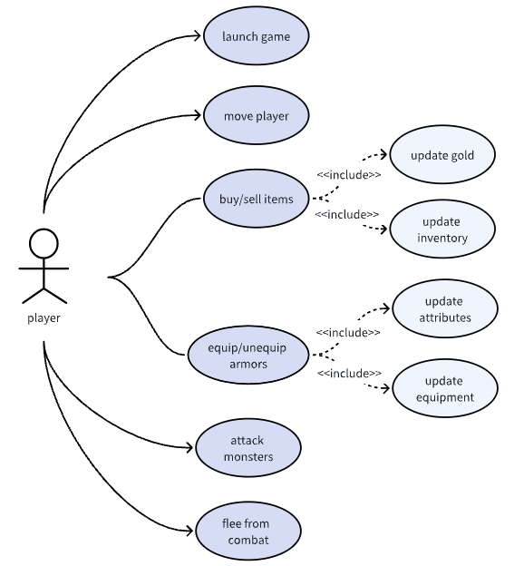
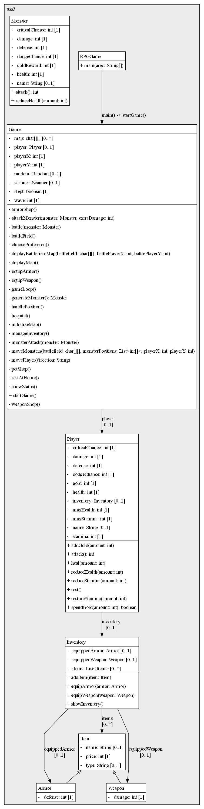

# COMP2120-Fri10_A3_A


## ❗️Important❗️

### We use [Jira](https://comp2120-fri-a3-a.atlassian.net/jira/software/projects/SCRUM/boards/1?atlOrigin=eyJpIjoiMjg3NjBkNjNmY2M5NGNiODllMjQwMmY4MTY3N2QwNDAiLCJwIjoiaiJ9) to manage our project.

### Our Wikis are managed through [Confluence](https://comp2120-fri-a3-a.atlassian.net/wiki/spaces/SD/overview).

Including:

- **[Project Plan](https://comp2120-fri-a3-a.atlassian.net/wiki/x/C4AF)**
- **[Project Summary](https://comp2120-fri-a3-a.atlassian.net/wiki/x/MgCK)**
- **[Game Skeleton](https://comp2120-fri-a3-a.atlassian.net/wiki/x/QoAl)**
- **[Installation & Setup](https://comp2120-fri-a3-a.atlassian.net/wiki/x/AoB_/)**
- **[Test Document](https://comp2120-fri-a3-a.atlassian.net/wiki/x/AQCL)**
- **[License Document](https://comp2120-fri-a3-a.atlassian.net/wiki/x/AoCL)**
- **[Working Hour Record](https://comp2120-fri-a3-a.atlassian.net/wiki/x/AQBV)**
- **[Meeting Agenda](https://comp2120-fri-a3-a.atlassian.net/wiki/x/AYAg)**
- **[Meeting Minutes](https://comp2120-fri-a3-a.atlassian.net/wiki/x/AwAq)**

You can also access the Confluence pages from the sidebar by navigating to Plan > Confluence. 

Click on the **blue links** to check out the corresponding content.


## [Game Background](https://comp2120-fri-a3-a.atlassian.net/wiki/spaces/SD/pages/edit-v2/9044018#Game-Background)

In this game, you step into the shoes of one of the legendary characters from the classic Chinese novel "Journey to the West" (Xi You Ji). The story revolves around a group of travelers on a quest to retrieve sacred Buddhist texts. You can choose to play as one of the four main characters:

* **Monkey King (Sun Wukong)**: A rebellious and powerful monkey with incredible strength and magical abilities.

* **Pigsy (Zhu Bajie)**: A half-man, half-pig creature known for his appetite and strength.

* **Sandy (Sha Wujing)**: A calm and reliable river ogre with great strength.

* **Tang Monk (Tang Sanzang)**: A human monk tasked with retrieving the sacred texts, protected by his disciples.

Your mission is to defend the village from waves of invading monsters (demons), grow stronger by acquiring weapons and armor, and ultimately defeat all the monsters to bring peace to the land.

---

## [Installation and Setup](https://comp2120-fri-a3-a.atlassian.net/wiki/x/AoB_/)

### Programming Language and Framework
- **Programming Language**: Java
- **Build Tool**: Maven
- **Testing Framework**: JUnit
- **JSON Processing Library**: Gson

### Dependencies
The project uses the following dependencies:
- **JUnit (version 4.12)**: For unit testing.
- **Gson (version 2.8.6)**: For handling JSON data.

### Installation Steps

* **Ensure Java is Installed**  
   Make sure you have the Java Development Kit (JDK) installed. You can check the Java version by running the following command in the terminal:
   ```bash
   java -version
* **Download and Install Maven:**

    - Visit the Apache Maven website to download the latest version of the Maven archive.
    
    - Unzip the downloaded file and move it to the /usr/local/ directory:
  ```bash
    sudo mv apache-maven-3.x.x /usr/local/apache-maven-3.9.9

---

## [Game Flow](https://comp2120-fri-a3-a.atlassian.net/wiki/spaces/SD/pages/edit-v2/9044018#Game-Flow)

Click on the blue title 'Game Flow' to go to the Confluence Page for more details on the Game Flow.

### Welcome and Introduction
- Press 'Enter' to start the game and ensure your keyboard is set to English.

### Character Selection
- Choose from four characters: Monkey King, Pigsy, Sandy, or Tang Monk, each with unique stats (HP, Stamina, Damage, etc.).

### Game Initialization
- Begin in the village with locations like:
    - **Home (H)**: Rest to recover HP and stamina.
    - **Weapon Shop (W)**: Buy weapons.
    - **Armor Shop (A)**: Buy armor.
    - **Clinic (C)**: Heal for a price.
    - **Gate (G)**: Enter the battlefield.

### Main Game Loop
- Navigate the village using 'W', 'A', 'S', 'D'.
- Manage your inventory ('I'), view status ('P'), or quit ('Q').

### Interactions in the Village
- **Rest (H)**: Recover once per return.
- **Buy Weapons (W)**: Bamboo Arrow, Iron Arrow, Fire Arrow.
- **Buy Armor (A)**: Wooden Shield, Iron Pants, Diamond Armor.
- **Heal (C)**: Minor Healing (20 gems), Major Healing (50 gems), Stamina Recovery (50 gems).

### Entering the Battlefield (G)
- Fight three waves of monsters. Each wave adds more monsters.

### Combat Mechanics
- Choose attack types: Light, Normal, Heavy, or Escape. Manage stamina and health.

### Defeating Monsters
- Earn gems after each victory. Return to the village to rest and upgrade equipment.

### Winning the Game
- Defeat all monsters in Wave 3 to win. Game ends with a victory message.

```text
Congratulations! You have defeated all monsters and won the game!
Your total gems: [number of gems]
```

---
## Use Cases


---
## UML



